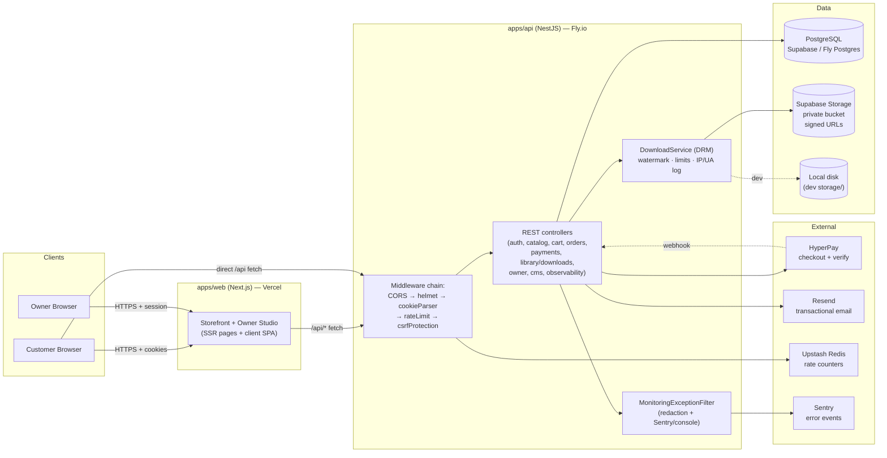

# Aurelia Books — System Architecture (Components)

## Request path rules

1. **CORS first** — rejected requests (403/429) still carry `Access-Control-Allow-Origin` so the browser shows the real message.
2. **Rate limiting before CSRF** — even attacks against the protections themselves are throttled. Policies: `auth/register` 3/min, `auth/login` 5/min, `payments/*` 10/min, `owner/*` 60/min, everything else 180/min.
3. **CSRF double-submit** — `aurelia_csrf` cookie + `X-CSRF-Token` header must match; `Origin`/`Referer` must equal `WEB_URL`. Only `POST /api/payments/webhook` is exempt (server-verified by HyperPay signature flow instead).
4. **Single DRM download path** — `GET /api/downloads/:productId` → DownloadService (revocation, expiry, count, watermark, IP/UA log). No bypass route exists.
5. **Server-only secrets** — `SUPABASE_SERVICE_ROLE_KEY`, `HYPERPAY_ACCESS_TOKEN`, `RESEND_API_KEY`, `AUTH_SECRET` never reach the browser; storage is private-bucket + signed URLs.

## Environment topology

| Concern | Development | Production (target) |
|---|---|---|
| Web | `next dev` :3001 | Vercel |
| API | `node dist/main.js` :3000 | Fly.io (+health check `/api/health`) |
| DB | Docker Postgres | Supabase Postgres (DATABASE_URL) |
| Storage | local `./storage` | Supabase private bucket |
| Payments | development provider | HyperPay TEST then LIVE |
| Email | console | Resend |
| Rate limiting | Upstash or no-op | Upstash (required, 503 without it) |
| Monitoring | console events | Sentry DSN |
