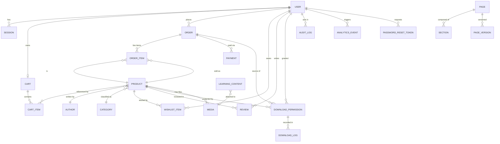

# Aurelia Books — Data Model (Prisma Entities)

> Generated from `prisma/schema.prisma`. Rendered directly on GitHub (Mermaid).

## Notes

| Model | Purpose | Security-relevant fields |
|---|---|---|
| `User` | Customers + ADMIN/OWNER roles | `passwordHash` (bcrypt), `role` |
| `Session` | Server-side sessions | `tokenHash` (hashed cookie token) |
| `Product` | Books | `status` (DRAFT/PUBLISHED/COMING_SOON/ARCHIVED), `archivedAt` |
| `Payment` | HyperPay/development payments | `checkoutId`, `transactionId`, `idempotencyKey` |
| `DownloadPermission` | DRM grant per user+product | `revokedAt`, `maxDownloads`, `downloadCount`, `expiresAt` |
| `DownloadLog` | Per-download audit | `ip`, `userAgent`, `status` |
| `AuditLog` | Owner mutation trail | `action`, `entity`, `metadata` |
| `Page`/`Section`/`PageVersion` | CMS (legal pages live here) | `status` (DRAFT/PUBLISHED) |
| `Media` | Stored files metadata | `storageKey` (never the file itself) |

Money columns (`Order.total`, `Payment.amount`, `Product.price`, `OrderItem.price`) are `DECIMAL(65,30)` to match Prisma Decimal semantics.
