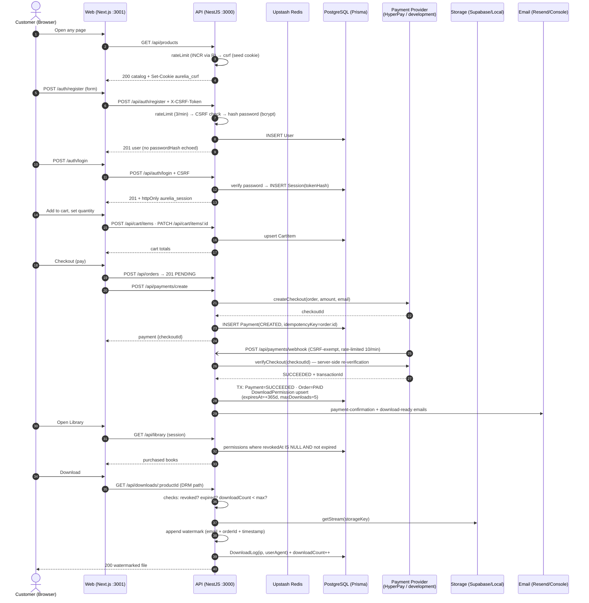

# Aurelia Books — Purchase Journey (Sequence)

> The full happy path: register → login → cart → checkout → payment → webhook → order PAID → library access → protected download.

## Failure paths covered by code (and where verified)

| Path | Behaviour |
|---|---|
| Rate limit exceeded | `429 Too many requests` (per-path policies, Upstash counters) |
| Missing/wrong CSRF | `403 Invalid CSRF token` |
| Payment verify fails | Payment=FAILED, Order back to PENDING |
| Permission revoked / expired / over limit | `403` with specific message |
| Storage object missing | `404 Book file is unavailable` (no raw 500) |
| Server error | MonitoringExceptionFilter → redacted error event (Sentry/console) |
